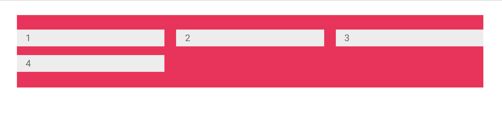
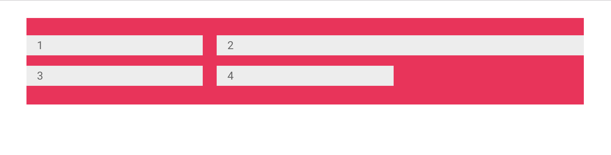

# LiquidGrid
Flexible Grid System for browsers which doesn't support Flex Box.

Liquid Grid adjust itself accordandly with the container dimensions. 
It can be formless containing collumns with different dimensions.


- Semantic & Expressive. 
- Uses percentage width for collumns calculated automaticaly.
- Uses `inline-block` for box modeling.

It was written in sass, but you can por it to whatever preprocessor you want, because it has only **25 lines of code**.

## Usage

A grid with 3 collumns and 20px gutters:

```sass
ul {
	@include grid( 3, 20px );
	li {
		background-color: #ededed;
		margin-bottom: 15px;
		padding: 0 15px;
	}
}

```

Output ( container with 800px )



Output ( container with 600px )


Item double size

```sass
ul {
	@include grid( 3, 20px );
	li {
		background-color: #ededed;
		margin-bottom: 15px;
		padding: 0 15px;
		&.double {
			@include col( 2/3 );
		}
	}
}

```

Output ( container with 600px )




# API

### @include grid( n collumns, gutter width(px) )

### @include col( collumns / n collumns, [ gutter width(px) ] ) 
If gutter not defined, it will be used from grid mixin. If grid mixin does not have a gutter defined, then it will be 0px.

#### Version 0.0.1

- Should work on IE9+ 
- Needs more tests on different devices and browsers


